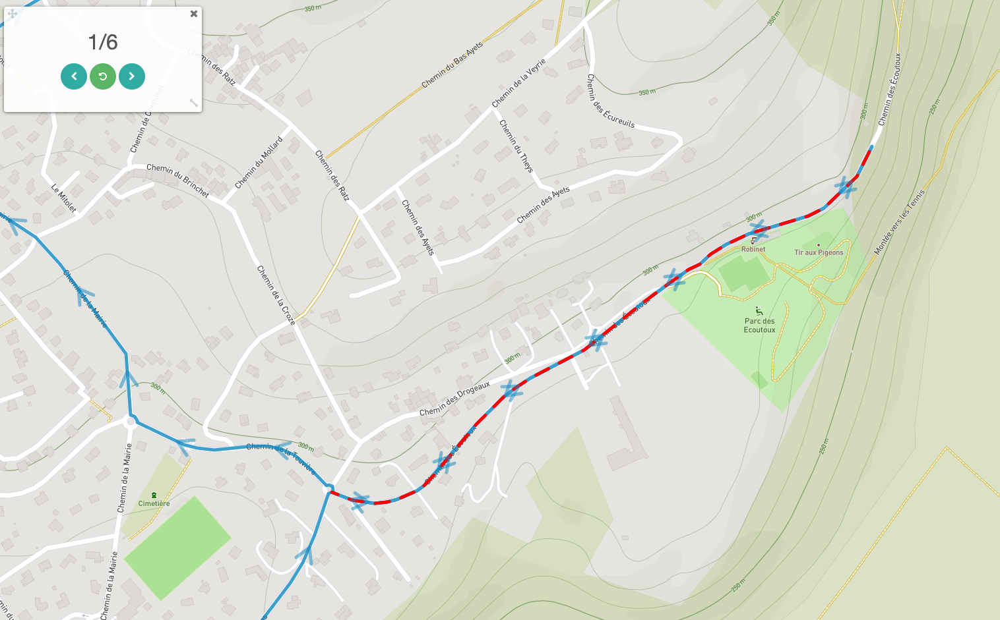

# Leaflet.GeojsonLayerSwitcher [](https://npmjs.org/package/leaflet-geojson-layer-switcher) [](https://travis-ci.org/EASYMOUNTAIN/Leaflet.GeojsonLayerSwitcher)

This plugin is intended to be used for Polyline selection. Navigates between layers and switches the selection state.

## Installation

### npm

```sh
$ npm install --save leaflet-geojson-layer-switcher
```

### browser

- Download or clone this github project
- Include `dist/Leaflet.GeojsonLayerSwitcher.min.js` and `dist/Leaflet.GeojsonLayerSwitcher.min.css` in your project

### compile

- Download or clone this github project
- Run `npm i` in the project folder
- Run `npm run build`

## Demo



## Usage

### es6 include

```js
import L from 'leaflet';
import leafletGeojsonLayerSwitcher from 'leaflet-geojson-layer-switcher';
leafletGeojsonLayerSwitcher(L);
```

Don't forget to link the CSS file.

### non-es6 include

```html
<link rel="stylesheet" href="Leaflet.GeojsonLayerSwitcher.min.css" />
<script src="Leaflet.GeojsonLayerSwitcher.min.js"></script>
```

```js
require('Leaflet.GeojsonLayerSwitcher.min.js').default(L);
```

### Interaction

```js
const map = L.map('map', {
    center: [45.1834782, 5.7831946],
    zoom: 13
});

L.tileLayer('http://{s}.tile.openstreetmap.org/{z}/{x}/{y}.png').addTo(map);

const geojson = {
	type: "FeatureCollection",
	features: [
		{
			type: "Feature",
			properties: {
				enabled: true
			},
			geometry: {
				type: "LineString",
				coordinates: [[5.0,45.0],[5.1,45.1],[5.0,45.2]]
			}
		},
		{
			type: "Feature",
			properties: {
				enabled: false
			},
			geometry: {
				type: "LineString",
				coordinates: [[6.0,46.0],[6.1,46.1],[6.0,46.2]]
			}
		},
		{
			type: "Feature",
			properties: {},
			geometry: {
				type: "LineString",
				coordinates: [[7.0,47.0],[7.1,47.1],[7.0,47.2]]
			}
		}
	]
};

const handler = L.geoJSONLayerSwitcher(map, {
	propertyStateSelected: 'enabled'
});

handler.enable();
handler.addData(geojson);

// USER INTERACTS WITH PLUGIN

const selectedLayersArray = handler.getSelection();
handler.disable();

//Do whatever you want with your layers.
```

## API

### Factory `L.geoJSONLayerSwitcher(<Map> map, <Object> options?)`

#### Options
- propertyStateSelected `<String>` : The feature's property name containing a boolean defining wether the layer is selected. If feature does not have this property, it will be initialized to `false`. Default property is `'selected'`.
- style `<Object>` : Customize style applied to polylines which are not selected. Default is dashed and red.
- styleSelected `<Object>` : Customize style applied to selected polylines. Default is dashed and green.
- selectButton `<Object>` : Customize how the selection button should appear. `icon` is the name of a font-awesome class, which defaults to `'fa-plus'`. `bgColor` allows you to change the default green.
- deselectButton `<Object>` : Customize how the de-selection button should appear. `icon` defaults to `'fa-minus'` and `gColor` defaults to red.
- popupAnchor `<Array>` : Allows you to change Leaflet.Dialog anchor. Defaults to `[10, 60]`.

Note : style and styleSelected support PolylineDecorator. Just provide the `patterns` key any configuration needed from PolylineDecorator.

## License

MIT © [Easy-Mountain](https://github.com/easymountain)
